# Joint Savings Account

### Background

A fintech startup company has recently hired you. This company is disrupting the finance industry with its own cross-border, Ethereum-compatible blockchain that connects financial institutions. Currently, the team is building smart contracts to automate many of the institutions’ financial processes and features, such as hosting joint savings accounts.

To automate the creation of joint savings accounts, you’ll create a Solidity smart contract that accepts two user addresses. These addresses will be able to control a joint savings account. Your smart contract will use ether management functions to implement a financial institution’s requirements for providing the features of the joint savings account. These features will consist of the ability to deposit and withdraw funds from the account.

#### Step 1: Create a Joint Savings Account Contract in Solidity

1. From the provided [starter code](Starter_Code), open the Solidity file named `joint_savings.sol` in the Remix IDE.
    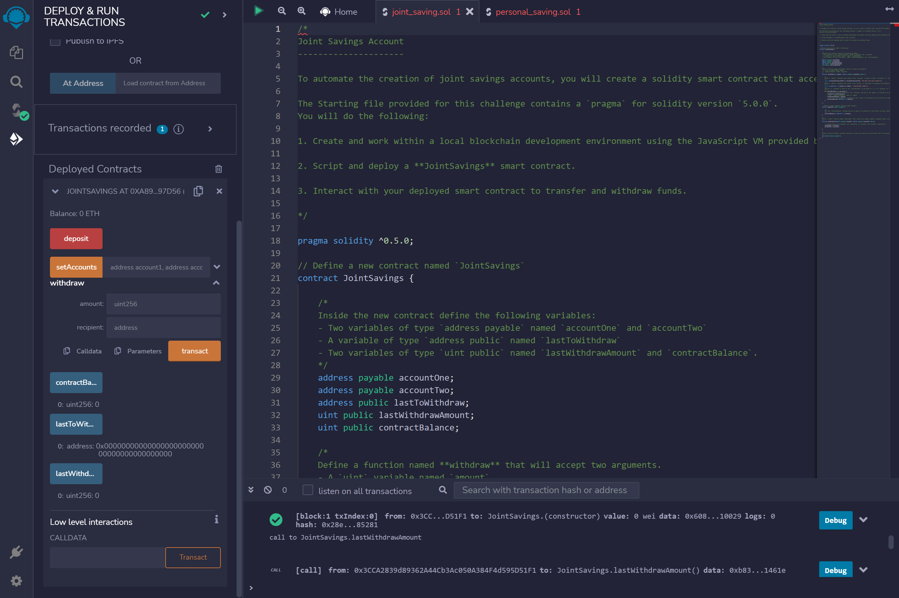
2. Define a new contract named `JointSavings`.

        contract JointSavings {

3. Define the following variables in the new contract:

    * Two variables of type `address payable` named `accountOne` and `accountTwo`
 
    * A variable of type `address public` named `lastToWithdraw`

    * Two variables of type `uint public` named `lastWithdrawAmount` and `contractBalance`

            address payable accountOne;

            address payable accountTwo;

            address public lastToWithdraw;

            uint public lastWithdrawAmount;

            uint public contractBalance;

4. Define a function named `withdraw` that accepts two arguments: `amount` of type `uint` and `recipient` of type `payable address`. In this function, code the following:

    * Define a `require` statement that checks if `recipient` is equal to either `accountOne` or `accountTwo`. If it isn’t, the `require` statement returns the “You don't own this account!” text.

    * Define a `require` statement that checks if `balance` is sufficient for accomplishing the withdrawal operation. If there are insufficient funds, it returns the “Insufficient funds!” text.

    * Add an `if` statement to check if `lastToWithdraw` is not equal (`!=`) to `recipient`. If it’s not equal, set it to the current value of `recipient`.

    * Call the `transfer` function of the `recipient`, and pass it the `amount` to transfer as an argument.

    * Set `lastWithdrawAmount` equal to `amount`.

    * Set the `contractBalance` variable equal to the balance of the contract by using `address(this).balance` to reflect the new balance of the contract.

    *
    
     
        function withdraw(uint amount, address payable recipient) public {

        require(recipient==accountOne || recipient==accountTwo, "You don't own this account!");

        require( address(this).balance >= amount , "Insufficient funds!");

        if (lastToWithdraw != recipient) lastToWithdraw = recipient;
        
        recipient.transfer(amount); 
        
        lastWithdrawAmount = amount;
        
        contractBalance= address(this).balance;
        }

5. Define a `public payable` function named `deposit`. In this function, code the following:

    * Set the `contractBalance` variable equal to the balance of the contract by using `address(this).balance`.

            function deposit() public payable {
            contractBalance = address(this).balance; 

            }    

6. Define a `public` function named `setAccounts` that takes two `address payable` arguments, named `account1` and `account2`. In the body of the function, set the values of `accountOne` and `accountTwo` to `account1` and `account2`, respectively.

        function setAccounts(address payable account1, address payable account2) public{

            accountOne = account1;
            accountTwo = account2;

        }

7. Add a fallback function so that your contract can store ether that’s sent from outside the deposit function.

            function() external payable {
    }

#### Step 2: Compile and Deploy Your Contract in the JavaScript VM

1. Remix IDE and compile and deploy contract

2. Deploy Contract in Ganache
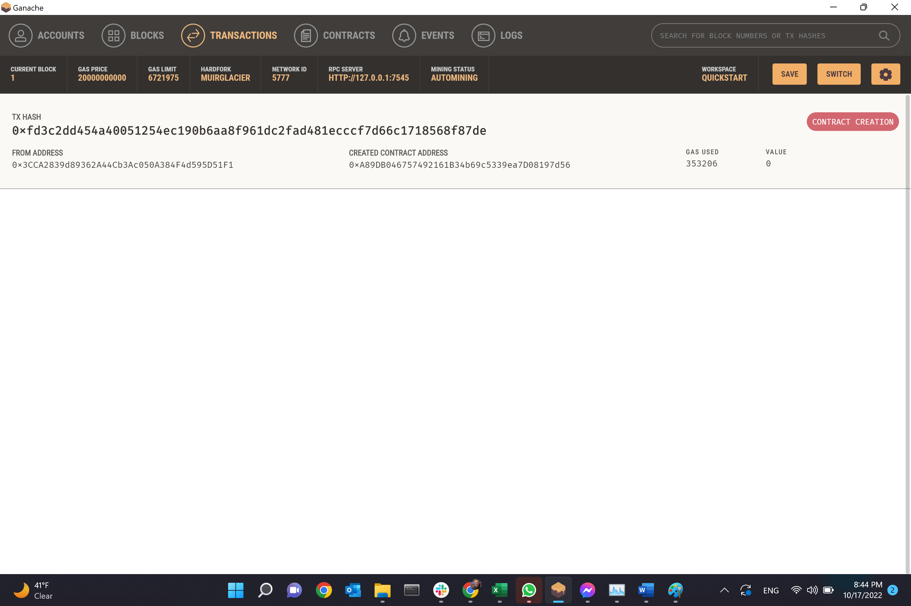

3. Deposit 1 Wei 
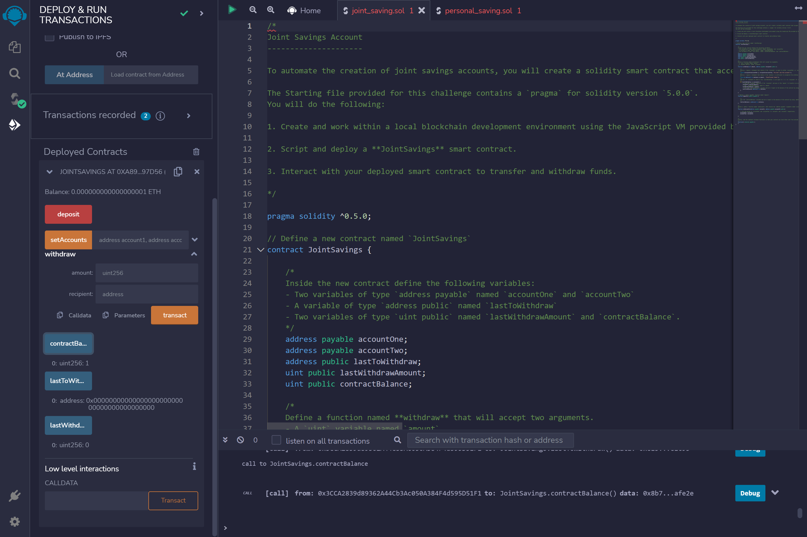

4. Deposit 1 Wei in Ganache 
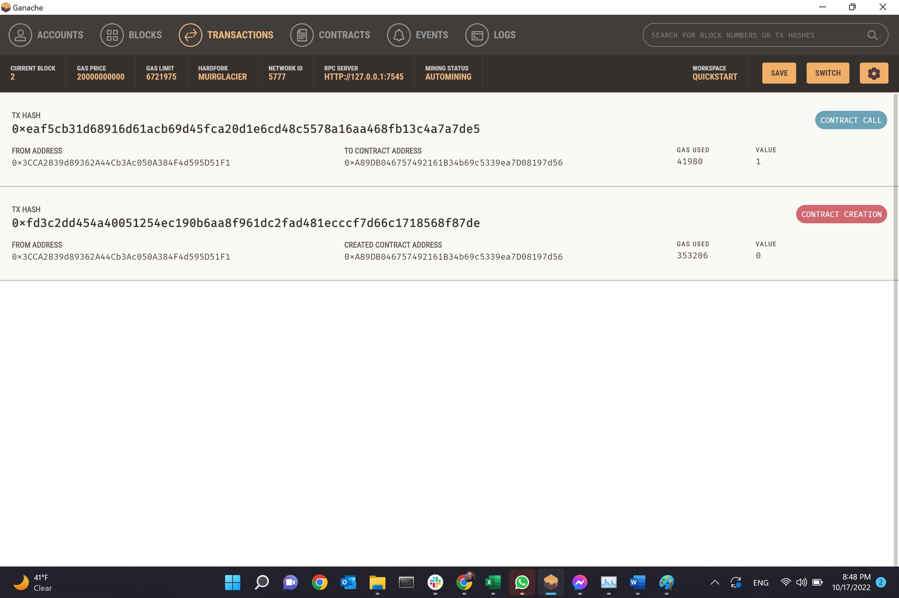

5. Read LastWithdraw and Balance 
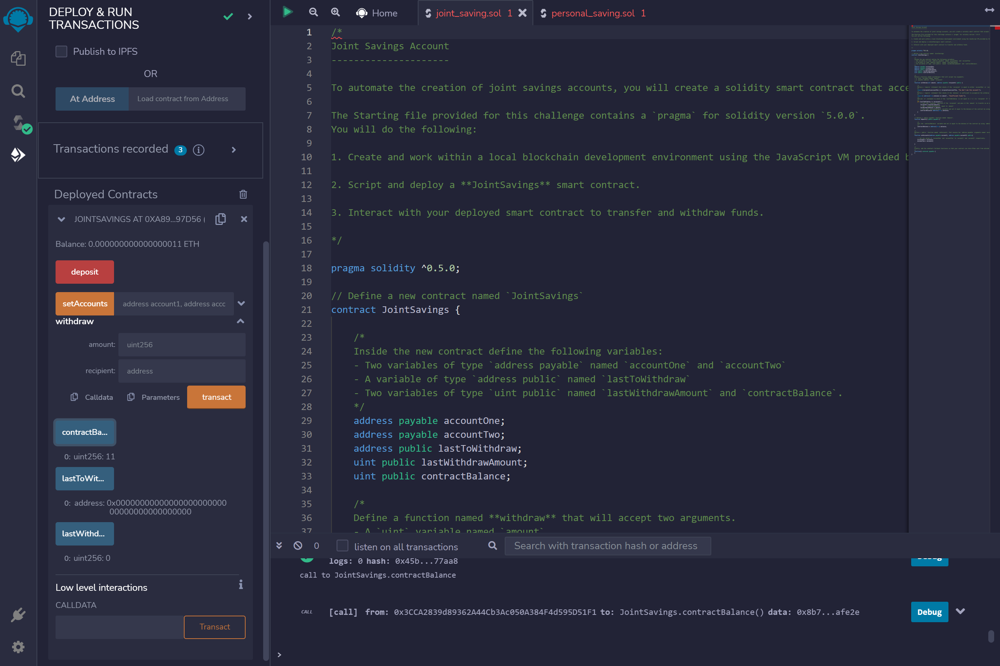

6. Read LastWithdraw and Balance
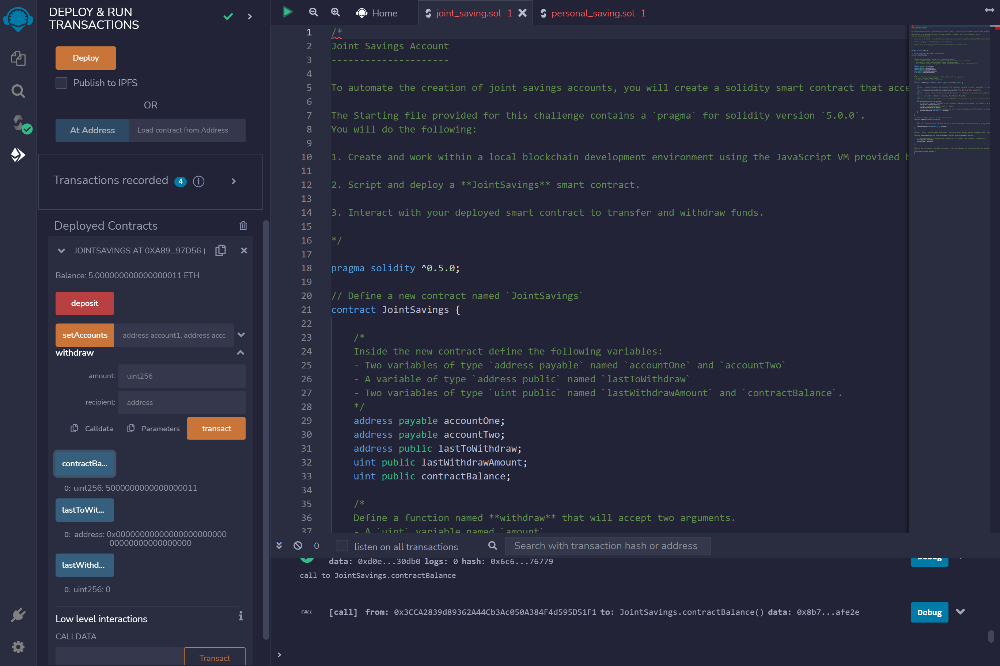

7. Withdraw before set accounts 
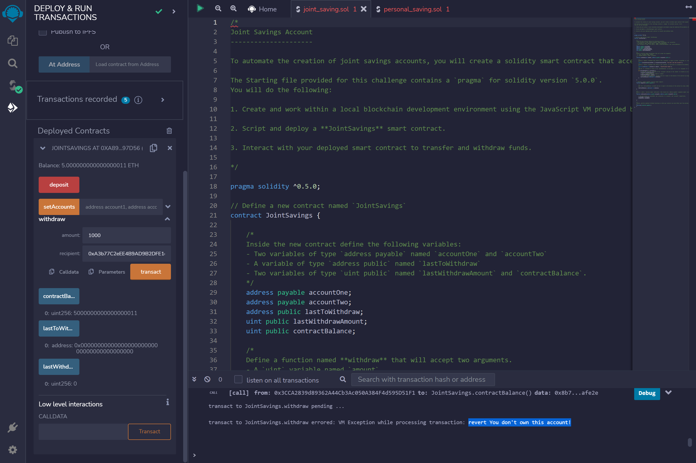

8. Set Accounts 
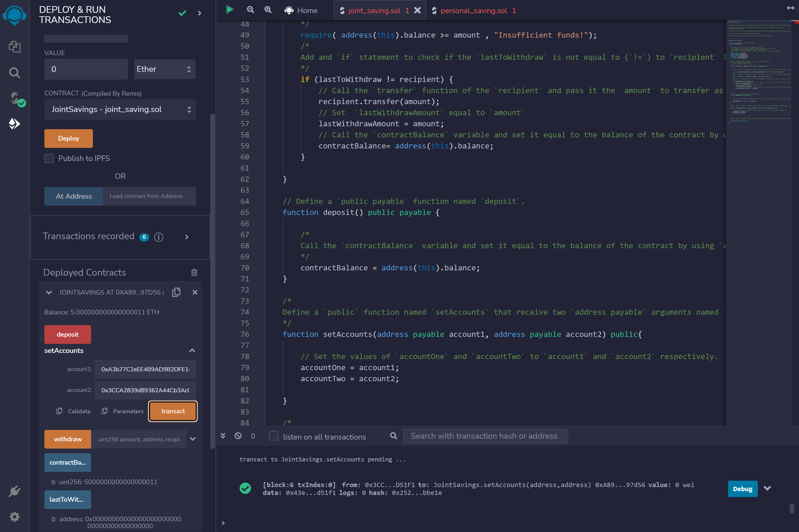

9. Do Withdraw
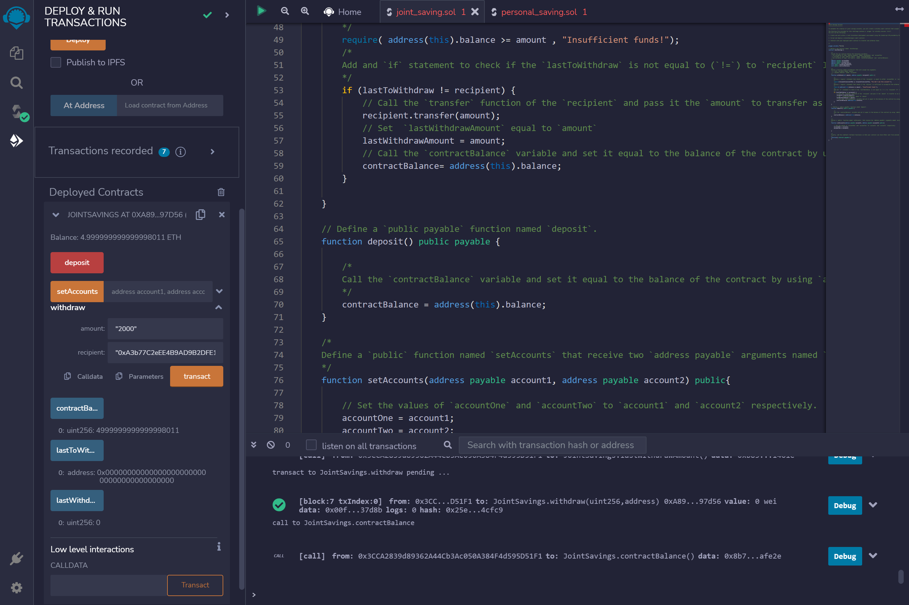

10. Read LastWithdraw and Balance
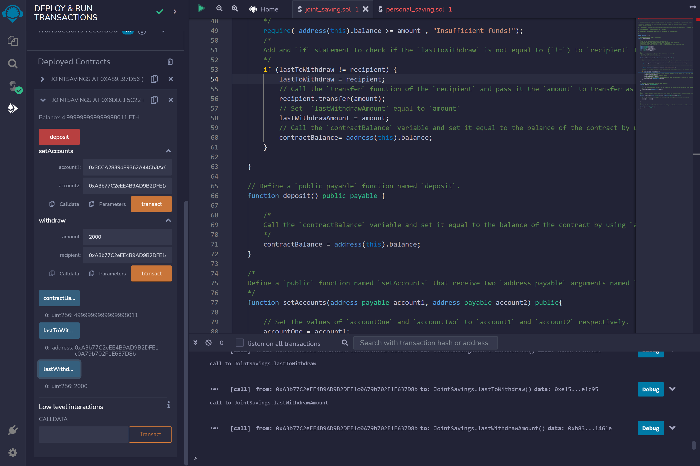

11. Withdraw with more than deposit 
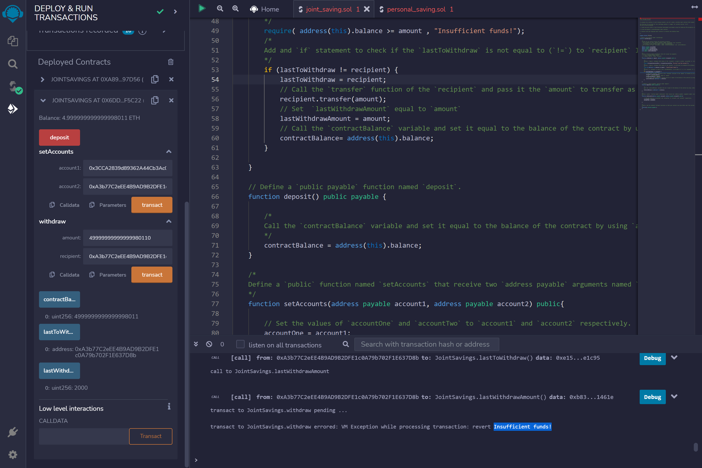

12. Transaction detail in Ganache 
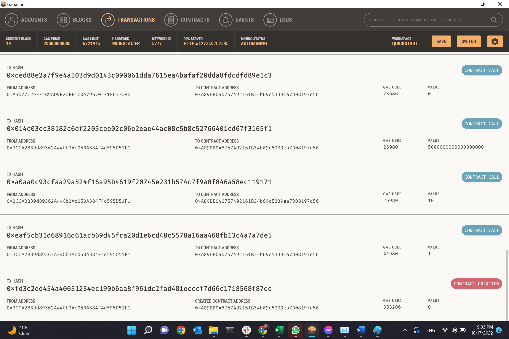

## Files:
1. [Solidity File ](joint_saving.sol)

